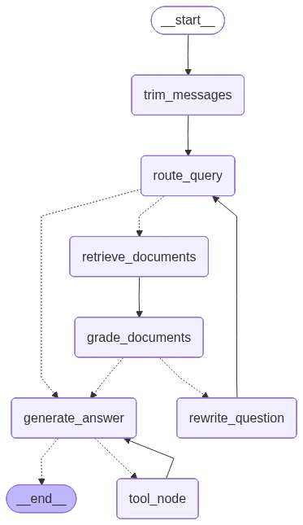

# Agent 设计 + MCP

[English](06-agent-and-mcp.md) | [中文](06-agent-and-mcp.zh-CN.md)

## 技术介绍

- **LangGraph**：将问答流程建模为状态图。
- **LangChain**：LLM 与工具调用抽象。
- **FastMCP**：将 OpenAPI 能力映射为 MCP Server。
- **MultiServerMCPClient**：Agent 侧拉取并调用 MCP 工具。

## 具体实现细节

### Agent 图编排

`agent/graph.py` 中主流程节点包括：

- `trim_messages`
- `route_query`
- `retrieve_documents`
- `grade_documents`
- `rewrite_question`
- `generate_answer`
- `tool_node`

关键逻辑：

- 根据 LLM 输出是否包含 tool calls 决定是否进入检索。
- 检索后先做文档相关性评分，不满足时可重写问题重试。
- 对 chat/tool/retrieve 调用次数设上限，避免无限循环。

### 会话状态持久化

- 使用 `AsyncPostgresSaver` 持久化 Agent 状态与线程上下文。

### MCP 服务端

`agent/server.py` 中：

- 读取后端 OpenAPI 生成 MCP 能力（排除 chat/reports 标签）
- 额外提供自定义工具 `get_financial_report`
- 同步提供 `/health`

### MCP 客户端接入

- API 启动时注入 `MultiServerMCPClient` 到 `app.state.mcp`。
- 聊天执行阶段动态拉取 `tools` 并传给 Agent。

## 当前可能存在的问题

- 工具暴露策略主要依赖 route tag 排除，缺少细粒度工具权限模型。
- Agent 节点错误恢复策略需要更系统的错误分型。
- 多工具场景下的调用成本与延迟治理仍有优化空间。

## 后续改进思路

- 增加工具级白名单和参数级安全约束（最小权限）。
- 为节点失败增加标准化 fallback（重试、降级、直接答复）。
- 引入工具调用预算策略（按会话限制总调用次数/成本）。
- 结合 Langfuse 数据优化 prompt 与路由策略。
