# Technical Documentation

[English](README.md) | [中文](README.zh-CN.md)

This documentation set organizes the project's technical architecture and implementation details.
This documentation was generated with assistance from GPT-5.3-Codex.

## Project Summary

- Built an A-share analysis platform with FastAPI, SQLAlchemy Async, and PgQueuer to support asynchronous crawling and analysis workflows.
- Implemented a YAML-based rule engine and CNInfo/Yahoo data pipeline with retries, rate limiting, and caching.
- Delivered LangGraph + RAG + SSE chat, with Docker/Kubernetes deployment and OTel/Prometheus/Grafana observability.

## Table of Contents

1. [01 Architecture Design](./01-architecture.md)
2. [02 Data Storage (Alembic + PostgreSQL + MinIO)](./02-data-storage.md)
3. [03 Backend (FastAPI)](./03-backend-fastapi.md)
4. [04 Middleware (PgQueuer + Redis)](./04-middleware-pgqueuer-redis.md)
5. [05 Frontend (SvelteKit)](./05-frontend-sveltekit.md)
6. [06 Agent Design + MCP](./06-agent-and-mcp.md)
7. [07 RAG + pgvector + Hybrid Retrieval](./07-rag-pgvector-hybrid.md)
8. [08 Observability Platform (Including Langfuse)](./08-observability-and-langfuse.md)
9. [09 Testing + Deployment](./09-testing-and-deployment.md)

## Architecture Diagram

Docker Compose local development architecture (generated by `./scripts/create_compose_graph.sh`):

